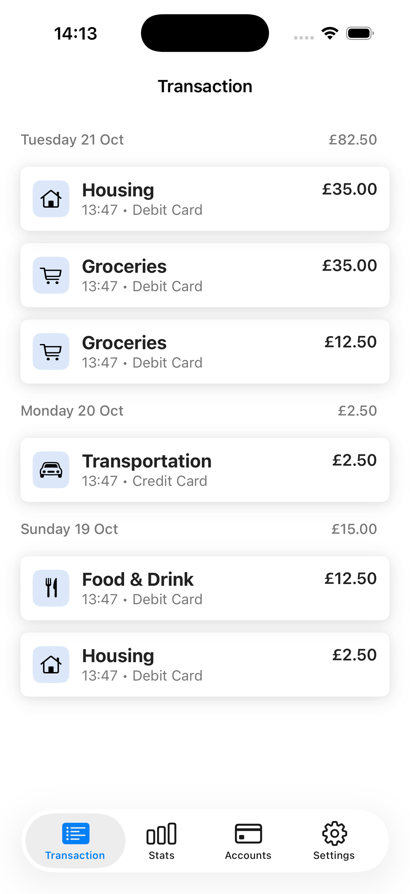

# Money Chronicle

A Swift UIKit app to track, record, and review your daily expenses.

## About

Money Chronicle is an iOS companion app built with UIKit, SnapKit, RxSwift, and Realm. It demonstrates a clean MVVM-C architecture for iOS development while providing practical functionality for personal finance. The app allows users to record each expense, categorize them, and review spending history easily.

Designed for simplicity and speed, Money Chronicle helps you stay aware of your daily spending and manage your budget without clutter or complexity.

## 📱 Screenshot

<p align="center">
  
</p>

## Features

### Current
- Record money spent with categories, notes, and amounts.
- Search for expenses by date.

### Upcoming
- Summary of total spending by day, week, or month.
- Basic statistics and charts to visualize spending patterns.

### Future Plans
- Sync records to a remote server for backup and cross-device access.
- Add iOS Shortcuts support to quickly add expenses without opening the app.
- Notifications and reminders for budget tracking.

## Technical Details

- **Minimum iOS Version**: iOS 16.6
- **Framework**: UIKit, SnapKit, RxSwift, Realm
- **Architecture**: MVVM-C (Model-View-ViewModel + Coordinator)

## Requirements

- iOS 16.6 or later
- Latest Xcode

## Installation

1. Clone the repository
```bash
git clone https://github.com/ychenbrian/money-chronicle-ios.git
```

2. Open the project in Xcode
```bash
cd money-chronicle-ios
open Chronicle.xcodeproj
```

3. Build and run on your device or simulator

## Contributing

This is a personal hobby project, but suggestions and feedback are welcome! Feel free to open an issue or submit a pull request.

## License

MIT License - feel free to use this project for learning or personal use.

---
